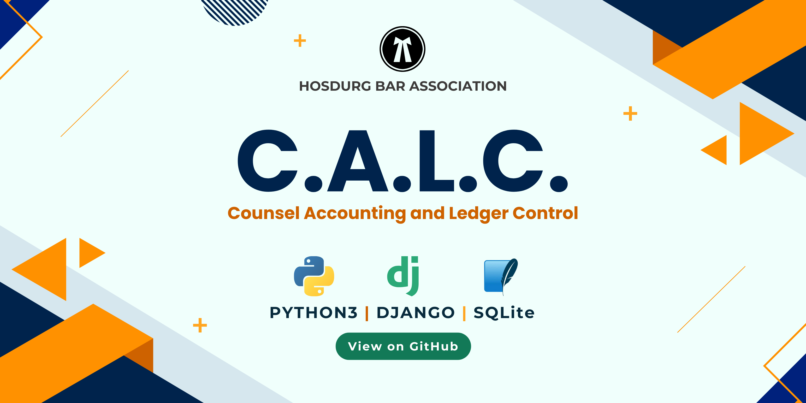

# ⚖️ CALC - Counsel Accounting and Ledger Control


**CALC** (Counsel Accounting and Ledger Control) is a Django-based web application developed for the **Hosdurg Bar Association**. It is designed to manage advocate details and systematically track their monthly payments to the association.

---

## 🚀 Features

- 🧑‍⚖️ **Advocate Management**
  - Register and manage advocate profiles.
  - Store personal and professional details.
  - CSV-based bulk upload/download support.

- 💰 **Payment Tracking**
  - Track mandatory ₹100 monthly payments.
  - Special annual payment logic (e.g. additional ₹500 in September).
  - Automatic due tracking from January onward.

- 🗓 **Dues Management**
  - "Check Dues" feature to record unpaid months.
  - Displays real-time pending dues and updates `due_amount` field.

- 🧾 **Payment System**
  - **Normal Pay**: Advance or current month payments.
  - **Debt Pay**: Clear outstanding dues.
  - Serial numbers formatted as `MM-YYYY.n` for payment tracking.

- 📄 **Payment History**
  - Advocate-specific payment breakdown.
  - Full ledger with filters (e.g. paid/unpaid for a specific month).

- 🧠 **Admin Panel**
  - Fully functional Django admin with secure login.
  - Edit advocates, payments, and due entries with ease.

---

## Installation

1. **Clone the repository:**
   ```bash
   git clone https://github.com/YourUsername/CALC.git
   cd CALC
   ```

2. **Create a virtual environment and activate it:**
   ```bash
   python -m venv venv
   source venv/bin/activate   # On Windows, use `venv\Scripts\activate`
   ```

3. **Install the dependencies:**
   ```bash
   pip install -r requirements.txt
   ```

4. **Set up the Django project:**
   ```bash
   python manage.py migrate
   python manage.py runserver
   ```

5. **Access the application:**
   - Open `http://127.0.0.1:8000/` in your web browser.

## Project Structure

- `calc/` – Main project folder containing settings and configurations.
- `payments/` – App for managing advocate details and payment tracking.
- `templates/` – HTML templates for the web interface.
- `static/` – Static files (CSS, JavaScript, images).

## Contributing

Contributions are welcome! Please submit a pull request or open an issue for any bugs or feature requests.

## License

This project is licensed under the MIT License. See the `LICENSE` file for more details.

## Acknowledgments

- Developed by Abhinav Raj for the Hosdurg Bar Association.
- Special thanks to the members of the association for their support and feedback.

## Contact

Developed by **Abhinav Raj**  
Feel free to reach out via [LinkedIn](https://www.linkedin.com/in/arj010/) or [Email](mailto:abhinavmuzhakom@gmail.com) for any questions or feedback.

